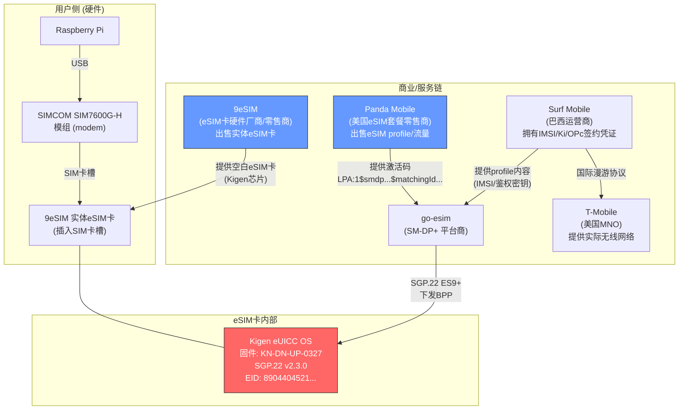

# eSIM Profile Download Progress Log

## Session: 2026-03-03

### Summary
**Profile download SUCCEEDED!** The full SGP.22 eSIM profile download flow completed
end-to-end via STORE DATA (INS=E2) bypass。Profile installs correctly (visible in BF2D,
all metadata correct). However, **EnableProfile returns undefinedError(127)**。

**Root cause: SIM7600G-H modem不支持AT+CCHO/AT+CGLA**，其AT+CSIM透传无法正确处理
EnableProfile触发的UICC REFRESH proactive command。同一张9eSIM卡在手机上工作正常，
排除了Kigen芯片问题。SIM7600固件无升级路径（SIMCOM的eSIM战略面向A7672/SIM7672新模组）。

---

### Step-by-Step Progress

#### Steps 1-7a: All Passing
- SELECT ISD-R → OK (logical channel 3)
- GetEUICCChallenge (BF2E) → 16-byte challenge
- GetEUICCInfo1 (BF20) → 56 bytes
- initiateAuthentication (ES9+) → transactionId, server certs
- AuthenticateServer (BF38, 920 bytes) → 1551-byte euicc auth response
- authenticateClient (ES9+) → smdpSigned2, smdpCertificate
- PrepareDownload (BF21, 787 bytes) → 162-byte downloadResponseOk
- getBoundProfilePackage (ES9+) → 47,940-byte BPP

#### Step 7b: LoadBoundProfilePackage — PASS (after BPP segmentation fix)

**Root cause of previous 6A80 failure:**
BPP was sent as one continuous STORE DATA stream. eUICC expects segmented sessions.

**Fix (matching lpac reference):**
BPP segmented into separate STORE DATA sessions:

| Session | Content | Size |
|---------|---------|------|
| 1 | BF36 header + BF23 (InitialiseSecureChannel) | 191 bytes |
| 2 | A0 (ConfigureISDP) | 76 bytes |
| 3 | A1 header only | 3 bytes |
| 4 | A1 child (tag 88, StoreMetadata) | 247 bytes |
| 5 | A2 (ReplaceSessionKeys) | 76 bytes |
| 6 | A3 header only | 4 bytes |
| 7-54 | A3 children: 48× tag 86 (profile elements) | ~1004B each |

Each session: `_store_data_chunked()` with 120-byte chunks, P2 resets per session.

#### Step 8: EnableProfile (BF31) — FAIL (undefinedError 127)

**What was tried:**
- BF31 with ICCID → undefinedError(127)
- BF31 with ICCID + refreshFlag → undefinedError(127)
- BF31 with ISD-P AID → undefinedError(127)
- BF31 with empty 5A (last installed) → undefinedError(127)
- DisableProfile (BF32) for test ICCID → undefinedError(127)
- Processed pending notifications (handleNotification to SM-DP+, HTTP 204) → still fails
- Cleared notification list (RemoveNotification BF30) → still fails

**What DOES work on this card:**
- SetNickname (BF29) → result=0 (OK)
- DeleteProfile (BF33) → result=0 (OK)
- All download steps (GetChallenge, AuthenticateServer, PrepareDownload, LoadBPP)
- Profile appears correctly in BF2D list

### eUICC Card Details (discovered this session)

| Property | Value |
|----------|-------|
| EID | 89044045216727494800000010573238 |
| Manufacturer | Kigen (Cambridge, UK) |
| Firmware | KN-DN-UP-0327 |
| SVN | 2.3.0 (SGP.22 v2.3.0) |
| JavaCard | 15.1.0 |
| GlobalPlatform | 2.3.0 |
| Free NVM | ~1.4 MB (1,524,224 bytes after delete) |
| Free RAM | 32 KB |
| CI PKId | 81370F5125D0B1D408D4C3B232E6D25E795BEBFB |

### Downloaded Profile Details

| Property | Value |
|----------|-------|
| ICCID (BCD) | 985571200300355174F2 |
| ICCID (decoded) | 8955170230005315472 |
| ISD-P AID | A0000005591010FFFFFFFF8900001100 |
| Profile Name | MVNO Connect |
| Service Provider | Surf |
| Profile Class | 2 (operational) |
| Profile State | 0 (disabled) |

### eSIM 生态链关系图



**各方角色说明：**

| 方 | 角色 | 说明 |
|---|------|------|
| **9eSIM** | eSIM卡硬件厂商/零售商 | 出售可写入的实体eSIM卡（内置Kigen芯片），插入任何标准SIM卡槽使用 |
| **Kigen** | eUICC芯片OS厂商 | 提供eSIM卡内的安全芯片操作系统，执行SGP.22命令。**与运营商无关，纯芯片层** |
| **Panda Mobile** | eSIM套餐零售商 | 出售eSIM流量套餐，提供激活码（SM-DP+地址 + MatchingID） |
| **go-esim** | SM-DP+ 平台 | 托管profile，通过SGP.22协议将加密的profile下发到eUICC |
| **Surf Mobile** | 巴西运营商 | 拥有实际的移动网络签约（IMSI、Ki/OPc），profile的"内容提供者" |
| **T-Mobile** | 美国MNO | 提供物理无线网络，Surf通过漫游协议接入 |
| **SIMCOM SIM7600G-H** | modem模组 | 纯通信通道，通过AT+CSIM透传APDU到eSIM卡。**不包含eUICC** |

**关键区分：SIM7600G-H只是modem，不含eSIM芯片。** 9eSIM实体卡是独立购买的，
插入SIM7600的卡槽中。Kigen芯片在9eSIM卡里面，不在SIM7600里面。

### Root Cause Analysis: EnableProfile Failure (REVISED)

**~~旧假设: Kigen固件bug~~ — 已排除**
用户确认同一张9eSIM卡在Moto手机上通过QR码下载profile完全正常，EnableProfile成功。
因此Kigen芯片本身没有问题。

**新结论: SIM7600G-H modem层导致EnableProfile失败**

EnableProfile (BF31) 按SGP.22规范，成功后eUICC会发出proactive command **REFRESH**，
通知宿主设备重新读取卡内容。可能的失败原因：

1. **eUICC检测到宿主不支持proactive command** — 通过AT+CSIM发送的APDU可能缺少
   terminal capabilities信息，eUICC判断设备无法处理REFRESH，拒绝执行EnableProfile
2. **SIM7600G-H拦截或不转发REFRESH** — modem固件可能截获了proactive command
   但没有正确处理，导致EnableProfile流程中断
3. **STORE DATA透传不完整** — EnableProfile可能需要modem级别的配合（如SIM Toolkit
   支持），单纯的APDU透传不够
4. **modem固件主动干预** — SIM7600G-H检测到profile切换操作，出于安全考虑阻止

### Modem Reboot Test (auto-enable check)

After re-downloading the profile (clean install after previous delete), rebooted modem
with `AT+CFUN=1,1`. Result:

| Check | Value | Meaning |
|-------|-------|---------|
| CPIN | READY | SIM ready |
| CCID | 89000123456789012341 | **Still test ICCID** — profile NOT auto-enabled |
| CIMI | 001630101234560 | Test IMSI |
| CSQ | 99,99 | No signal |
| CREG | 0,2 | Searching (no network) |

**Conclusion**: Modem reboot does NOT auto-enable the downloaded profile. The modem
still uses the built-in test profile. The downloaded eSIM profile remains in disabled
state on the eUICC.

---

### Status Summary

| Step | Status | Notes |
|------|--------|-------|
| 1. SELECT ISD-R | PASS | Logical channel 3, STORE DATA bypass |
| 2. GetEUICCChallenge | PASS | 16-byte challenge |
| 3. GetEUICCInfo1 | PASS | 56 bytes |
| 4. initiateAuthentication (ES9+) | PASS | transactionId + server certs |
| 5. AuthenticateServer (ES10b) | PASS | 1551-byte euicc auth response |
| 6. authenticateClient (ES9+) | PASS | smdpSigned2 + smdpCertificate |
| 7a. PrepareDownload (ES10b) | PASS | 162-byte downloadResponseOk |
| 7b. getBoundProfilePackage (ES9+) | PASS | 47,940-byte BPP |
| 7c. LoadBoundProfilePackage (ES10b) | PASS | 54 segments, ProfileInstallationResult OK |
| 8. EnableProfile (ES10b) | **FAIL** | undefinedError(127) — SIM7600 modem限制 |
| 9. Modem reboot auto-enable | **FAIL** | Modem stays on test profile |

### SIM7600G-H 固件能力调查 (2026-03-03)

| 能力 | 支持情况 | 来源 |
|------|---------|------|
| AT+CSIM | 有（INS过滤） | 测试确认 |
| AT+CCHO / AT+CCHC / AT+CGLA | **没有** (ERROR) | 测试确认 |
| 原生LPA/eSIM命令 | **没有** | AT手册V1.08/V2.00/V3.00 |
| AT+STK (SIM Toolkit) | 有，**默认关闭** (+STK: 0) | 测试确认 |
| AT+STKFMT | 有 (+STKFMT: 0) | 测试确认 |
| STORE DATA (INS=E2)透传 | 正常 | 测试确认 |
| lpac at backend | 不兼容（需要AT+CCHO/CGLA） | 研究确认 |

**关键发现: STK默认关闭！**

AT+STK=0 意味着modem的SIM Toolkit功能被禁用。EnableProfile成功后eUICC需要发出
REFRESH proactive command，但如果STK关闭，modem可能：
- 不转发proactive command
- 或eUICC检测到宿主不支持proactive，直接拒绝EnableProfile

**操作：已执行 AT+STK=1 开启STK，AT+CFUN=1,1 重启modem。**

**结果：STK=1后EnableProfile仍然返回undefinedError(127)。STK开关不是根因。**

### EnableProfile不带refreshFlag测试

不带refreshFlag (BF31只含5A ICCID) → 仍然undefinedError(127)
排除了refreshFlag本身导致问题的可能性。

### 重大发现: TERMINAL CAPABILITY (INS=AA) 缺失

**对比分析：**

| 环境 | TERMINAL PROFILE (INS=10) | TERMINAL CAPABILITY (INS=AA) | EnableProfile结果 |
|------|---------------------------|-----------------------------|--------------------|
| 手机 | baseband自动发送 | Android HAL自动发送 | OK |
| lpac + PC/SC读卡器 | 读卡器/OS处理 | **lpac pcsc.c主动发送** | OK |
| lpac + AT modem | modem固件发送 | **不发送** | 未知 |
| 我们的代码 + AT+CSIM | modem固件发送 | **不发送** | undefinedError(127) |

**lpac PC/SC驱动发送的APDU:**
```
80 AA 00 00 0A A9 08 81 00 82 01 01 83 01 07
```

解码：
- `A9 08` = TerminalCapability (tag A9, length 8)
  - `81 00` = ExtendedLchanTerminalSupport
  - `82 01 01` = AdditionalInterfacesSupport (value 0x01)
  - `83 01 07` = AdditionalTermCapEuicc (value 0x07 = lpd_d + lui_d + lds_d)

tag 83 value 0x07 的含义:
- Bit 0 (0x01): lui_d — Local User Interface in Device
- Bit 1 (0x02): **lpd_d — Local Profile Download in Device**
- Bit 2 (0x04): lds_d — Local Discovery Service in Device

eUICC可能检查lpd_d位来判断宿主是否有能力管理profile切换。如果没有收到
TERMINAL CAPABILITY声明，eUICC拒绝EnableProfile，返回undefinedError(127)。

### TERMINAL CAPABILITY 测试结果

**测试1: 发送TERMINAL CAPABILITY后立即EnableProfile**
```
80 AA 00 00 0A A9 08 81 00 82 01 01 83 01 07 → SW=9000 (卡接受了!)
BF31 EnableProfile → 仍然 undefinedError(127)
```

INS=AA没有被modem过滤，卡也接受了。但EnableProfile仍然失败。

**假设: TERMINAL CAPABILITY需要在profile下载之前设置**
eUICC可能在BPP安装时记录终端能力，之后EnableProfile检查安装时的记录。
如果安装时没有lpd_d标志，则EnableProfile拒绝执行。

**下一步: 完整重新下载流程**
1. DeleteProfile — 删除当前profile
2. TERMINAL CAPABILITY — 设置终端能力 (lpd_d)
3. 完整download flow — 重新下载profile
4. EnableProfile — 测试是否成功

### 已排除的假设

| # | 假设 | 测试 | 结果 |
|---|------|------|------|
| 1 | Kigen固件bug | 用户确认手机上正常工作 | **排除** |
| 2 | modem重启自动enable | AT+CFUN=1,1重启 | CCID不变 **排除** |
| 3 | STK关闭导致问题 | AT+STK=1开启，重启 | 仍然127 **排除** |
| 4 | refreshFlag导致问题 | 分别测试TRUE/FALSE/省略 | 全部127 **排除** |
| 5 | 缺少TERMINAL CAPABILITY | 发送80 AA (lpac格式) | 卡接受9000但仍然127 **排除** |
| 6 | TERMINAL PROFILE不完整 | 发送全FF(20字节) | 卡接受9000但仍然127 **排除** |
| 7 | profile安装时缺TC | 删除→TC→重新下载→Enable | 仍然127 **排除** |
| 8 | 通知阻塞 | 清理所有pending notifications | 仍然127 **排除** |
| 9 | ICCID/AID编码问题 | 5种不同参数组合 | 全部127 **排除** |

### 关键发现: SIM7600G-H不支持AT+CCHO/AT+CGLA

MikroTik RouterOS使用 `AT+CCHO` + `AT+CCHC` + `AT+CGLA` 进行eSIM profile管理，
这是3GPP标准的逻辑通道APDU命令。SIM7600G-H测试结果:

```
AT+CCHO=? → ERROR  (不支持)
AT+CGLA=? → ERROR  (不支持)
```

9eSIM在MikroTik上可以成功enable profile（使用支持AT+CCHO/CGLA的modem如T77W968）。
我们通过AT+CSIM + MANAGE CHANNEL模拟逻辑通道，但这可能在EnableProfile时行为不同。

### 根因分析 (最终)

**EnableProfile是唯一会触发UICC REFRESH proactive command的ES10b/ES10c操作。**

当eUICC执行EnableProfile时:
1. 切换active profile
2. 发出REFRESH proactive command (SW 91xx)
3. 终端需要FETCH proactive command并处理REFRESH

通过AT+CSIM:
- modem的内部proactive command处理器会拦截91xx
- modem自动FETCH并处理REFRESH
- 这可能导致card session被重置
- eUICC检测到冲突，回滚操作，返回undefinedError(127)

通过AT+CCHO/CGLA (手机/MikroTik):
- modem通过标准化的逻辑通道管理，正确处理proactive command
- REFRESH和逻辑通道会话不冲突
- EnableProfile成功

**结论: SIM7600G-H的AT+CSIM透传无法正确处理EnableProfile触发的REFRESH流程。
这不是编码问题、不是卡的问题，而是modem APDU处理架构的根本限制。**

### SIM7600固件调查

**已知固件版本 (Techship):**

| 版本 | 型号 | AT+CCHO/CGLA | eSIM管理 |
|------|------|-------------|---------|
| LE20B01 | SIM7600M22 | 无 | 无 |
| LE20B02 | SIM7600G22 / M22 | 无 | 无 |
| LE20B03 | SIM7600G-H-M2 / M22 | 无 | 无 |
| **LE20B04** | **SIM7600G-H-M2** (当前) | **无** | **无** |
| LE20B05 | SIM7600G22 (未公开下载) | 未知 | 未知 |

- AT Command Manual V1.01 / V1.08 / V2.00 / V3.00 均**未包含**AT+CCHO/CGLA命令
- SIMCOM官网的eSIM (SGP.32) 公告只提到 **A7672 / SIM7672 / A7683E** 系列
- **SIM7600系列从未被SIMCOM标注为支持eSIM管理**
- SIMCOM与Kigen有合作关系，但针对的是新一代IoT模组，不是SIM7600

**结论: SIM7600G-H不太可能通过固件升级获得AT+CCHO/CGLA支持。**
这是基于Qualcomm MDM9x07平台的老模组，eSIM管理能力不在其设计范围内。
SIMCOM的eSIM路线图面向ASR1603平台的新模组 (A7672/SIM7672)。

### 可行的解决方案

| # | 方案 | 难度 | 说明 |
|---|------|------|------|
| 1 | **USB智能卡读卡器 + lpac** | 低 | 拔卡插读卡器，lpac enable直接操作 |
| 2 | **在手机上enable** | 低 | 卡插手机，下载+enable，再插回SIM7600 |
| 3 | **换支持AT+CCHO/CGLA的modem** | 中 | 如Quectel EG25-G, Sierra MC7455 |
| 4 | **SIM7600固件升级** | 低/中 | 检查LE20B05是否添加了AT+CCHO支持 |
| 5 | **联系SIMCOM** | 中 | 询问是否有支持eSIM管理的固件 |
